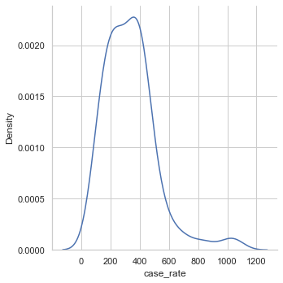
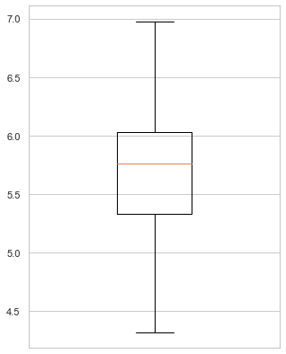

## Markdown


```python
import pandas as pd
import matplotlib.pyplot as plt

import statsmodels.api as sms
from statsmodels.formula.api import ols
from statsmodels.stats.outliers_influence import variance_inflation_factor
import numpy as np
import seaborn as sns

from sklearn import preprocessing
from sklearn.model_selection import train_test_split
from statsmodels.nonparametric.smoothers_lowess import lowess
plt.rc("font", size=14)
sns.set(style="white")
sns.set(style="whitegrid", color_codes=True)
```

#### Read the 'data.csv' file and create a dataframe 'df'


```python
data_filename = pd.read_csv('data2.csv')
df = pd.DataFrame(data_filename)
```

#### Check the distribution of the observations of COVID-19 case rate in cities of England in the winter of 2020.


```python
sns.displot(df, x = 'case_rate', kind="kde")
plt.savefig('case_rate')
```


    

    


As the plot is heavily right-tailed (positively skewed), we apply a log-linear model in the analysis where the new dependent variable is the natural logarithm of the observations of COVID-19 case rate in local authority area i of England


```python
sns.displot(df, x = 'log_case_rate', kind="kde")
plt.savefig('log_case_rate')
```


    

    


The second plot looks more similar to normal distirbution.

#### Check the outliers of the observations (COVID-19 case rate in city i of England in month j)


```python
case_rate= df['log_case_rate']
Q1 =  case_rate.quantile(0.25)
Q3 = case_rate.quantile(0.75)
IQR = Q3 - Q1


case_rate_outliers = df['Lower Tier Local Authority'][(df['log_case_rate'] < Q1-1.5*IQR ) | (df['log_case_rate'] > Q3+1.5*IQR)]

case_rate_no_outliers = df['Lower Tier Local Authority'][(df['log_case_rate'] > Q1-1.5*IQR ) | (df['log_case_rate'] < Q3+1.5*IQR)]

case_rate_outliers
```


    Series([], Name: Lower Tier Local Authority, dtype: object)


#### Draw the boxplot to visualize the distribution of 'log(case_rate)'


```python
output_filename = 'boxplot'
figure_width, figure_height = 5,7
plt.figure(figsize=(figure_width,figure_height))
plt.xlim([0.75,1.25])
plt.xticks([])
plt.boxplot(np.log(df['case_rate']), manage_ticks=(False))
plt.savefig(output_filename)
```


    

    


No outliers in the values of 'log(case_rate)'

### ANCOVA model


```python
# Create dummy variables for time and region variables
Month = pd.get_dummies(df['month'])
Month = Month[['November','December']]

Region = pd.get_dummies(df['region'])
Region = Region[['East of England','North East', 'North West', 'South East', 'South West', 'East Midlands', 'West Midlands','Yorkshire and the Humber']]
# Create the variables for climate features: 'precipitation','humidity' and 'temp'
x_values = df[['precipitation','humidity','temperature','population_density']]

# Combine the variables for climate features with dummy variables for time and region variables
x_values = pd.concat([x_values, Month, Region], axis=1, sort=False)

# Create the dependent variable
y_values = df['log_case_rate']
```

#### Firstly check the correlation between independent variables by a heat map)


```python
fig = plt.figure(figsize=(16,8))
sns.heatmap(x_values.corr(),annot = True,cmap='YlGnBu', linecolor='r',linewidth=0.5)
output_filename = 'correlation matrix'
plt.savefig(output_filename)
```


    

    


As the correlations between the dummy variable 'December' and the variable of temperature is larger than 0.05, we cannot assume that multicollinearity doesn't exist.
Hence, we remove the dummy variable 'December' from the model.


```python
# Create dummy variables for time and region variables and remove variables for 'December'
Month = pd.get_dummies(df['month'])
Month = Month['November']

Region = pd.get_dummies(df['region'])
Region = Region[['East of England','North East','North West','South East','South West','East Midlands','West Midlands','Yorkshire and the Humber']]

x_values = df[['temperature', 'humidity','precipitation','population_density']]
x_values = pd.concat([x_values, Month, Region], axis=1, sort=False)

# Create the dependent variable
y_values = df['log_case_rate']

X_values = sms.add_constant(x_values)
regression_model_a = sms.OLS(y_values, X_values)

regression_model_b = regression_model_a.fit()

# Print a summary of the results:
print(regression_model_b.summary())

fig = plt.figure(figsize=(20,10))
sns.heatmap(x_values.corr(),annot = True,cmap='YlGnBu', linecolor='r',linewidth=0.5)

```

                                OLS Regression Results                            
    ==============================================================================
    Dep. Variable:          log_case_rate   R-squared:                       0.312
    Model:                            OLS   Adj. R-squared:                  0.242
    Method:                 Least Squares   F-statistic:                     4.430
    Date:                Tue, 19 Jan 2021   Prob (F-statistic):           3.68e-06
    Time:                        03:46:25   Log-Likelihood:                -84.746
    No. Observations:                 141   AIC:                             197.5
    Df Residuals:                     127   BIC:                             238.8
    Df Model:                          13                                         
    Covariance Type:            nonrobust                                         
    ============================================================================================
                                   coef    std err          t      P>|t|      [0.025      0.975]
    --------------------------------------------------------------------------------------------
    const                        9.7156      1.649      5.893      0.000       6.453      12.978
    temperature                 -0.0835      0.018     -4.757      0.000      -0.118      -0.049
    humidity                    -5.2973      1.883     -2.813      0.006      -9.023      -1.571
    precipitation                0.0072      0.003      2.816      0.006       0.002       0.012
    population_density       -1.122e-06   2.01e-05     -0.056      0.956   -4.09e-05    3.86e-05
    November                     0.3125      0.085      3.670      0.000       0.144       0.481
    East of England              0.6759      0.262      2.581      0.011       0.158       1.194
    North East                   0.7166      0.267      2.682      0.008       0.188       1.245
    North West                   0.6874      0.233      2.946      0.004       0.226       1.149
    South East                   0.7743      0.243      3.192      0.002       0.294       1.254
    South West                   0.6269      0.242      2.590      0.011       0.148       1.106
    East Midlands                0.6719      0.253      2.659      0.009       0.172       1.172
    West Midlands                0.7623      0.249      3.068      0.003       0.271       1.254
    Yorkshire and the Humber     0.6551      0.247      2.649      0.009       0.166       1.144
    ==============================================================================
    Omnibus:                        2.927   Durbin-Watson:                   2.213
    Prob(Omnibus):                  0.231   Jarque-Bera (JB):                2.639
    Skew:                           0.334   Prob(JB):                        0.267
    Kurtosis:                       3.058   Cond. No.                     2.03e+05
    ==============================================================================
    
    Notes:
    [1] Standard Errors assume that the covariance matrix of the errors is correctly specified.
    [2] The condition number is large, 2.03e+05. This might indicate that there are
    strong multicollinearity or other numerical problems.
    


    <AxesSubplot:>


    

    


#### Check the model fitness by residuals vs fitted plot:


```python
residuals = regression_model_b.resid
fitted = regression_model_b.fittedvalues
smoothed = lowess(residuals,fitted)
top3 = abs(residuals).sort_values(ascending = False)[:3]

plt.rcParams.update({'font.size': 16})
plt.rcParams["figure.figsize"] = (8,7)
fig, ax = plt.subplots()
ax.scatter(fitted, residuals, edgecolors = 'k', facecolors = 'none')
ax.plot(smoothed[:,0],smoothed[:,1],color = 'r')
ax.set_ylabel('Residuals')
ax.set_xlabel('Fitted Values')
ax.set_title('Residuals vs. Fitted')
ax.plot([min(fitted),max(fitted)],[0,0],color = 'k',linestyle = ':', alpha = .3)

for i in top3.index:
    ax.annotate(i,xy=(fitted[i],residuals[i]))

plt.show()
```


    

    

